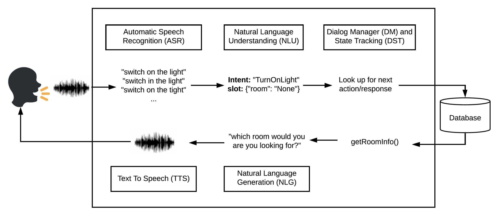

An introduction
===============

A conversational AI system or a dialogue system is a computer program which could interact with humans in natural language (by text, speech and sometimes utilizes support from graphical user interface (GUI)). Generally, a dialogue system could be categorized into task-oriented dialogue systems or chatbots.
Conversational AI systems comprise a set of tools such as speech recognition, language understanding, state tracker, dialogue manager, language generator and text-to-speech. A typical system could be depicted in figure 1.
Information about the overview of publicly available conversational AI platforms has been well-presented in this research, section 1.1.

By doing this project, we aim to make a platform that follows the standard existing architectures. This platform is targeting for users which are developers or researchers who want to build or experiment with dialogue system applications. We aim to provide a platform that could help us to:

- Easily build, train and deploy task-oriented dialogue systems for production.
- Provide a set of pre-train models and flexible design for experimentation purposes.
- Quickly prototype and test out “state of the art” research for each component in the system.
- Every component can be trained independently online or offline.
- Provide mechanisms for customizing each component according to specific business domain.