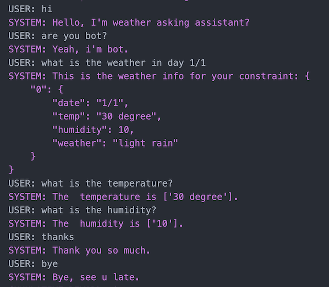

Summarize
=========

In this section, just help you to clone all thing we've done above.

1. init ``WeatherAsking`` with commandline

.. code-block:: shell

    comet init -d weather

After ``init`` your folder will be look like:

.. code-block::

    .
    ├── config
    │   ├── configure_infer.yaml
    │   ├── configure_simulation.yaml
    │   └── configure_train.yaml
    ├── data
    │   ├── agent_template_nlg.json
    │   ├── usr_template_nlg.json
    │   ├── weather_database.json
    │   ├── weather_domain.json
    │   └── weather_ontology.json
    └── src
        ├── __init__.py
        ├── utils
        │   ├── constants.py
        │   └── __init__.py
        ├── weather_database.py
        ├── weather_dst.py
        ├── weather_handcraft_policy.py
        ├── weather_nlu.py
        ├── weather_state_featurizer.py
        ├── weather_template_nlg.py
        ├── weather_user_simulator.py
        └── weather_warm_up_policy.py

2. Setup axiom account and other configure if needed in ``.env` file

.. code-block:: shell

    AXIOM_EMAIL='user_email@ftech.ai'
    AXIOM_PASSWORD='password'

3. Download ``nlu training data`` with commandline

.. code-block:: shell

    comet data download

You will see ``assets`` folder something similar this:

.. code-block::

    ./assets
    └── WeatherAsking
        └── v0.2.0
            └── nlu
                ├── eval.csv
                ├── test.csv
                └── train.csv

4. Generate conversation data (policy training data) interact with user simulator by commandline

.. code-block:: shell

    comet run --config ./config/configure_simulation.yaml

You will see ``assets`` folder something similar this:

.. code-block::

    ./assets
    └── Weather_asking
        └── v0.2.0
            └── records
                ├── train_supervised_dialogues.json
                └── train_supervised_dialogues.pkl

5. Run ``configure_train.yaml`` to train NLU and ``supervised policy`` with the data we prepared.

.. code-block:: shell

    comet run --config ./config/configure_train.yaml

.. warning::

    It will appear a terminal and you(user) must be interact with agent. You should terminate the dialogue with message: ``/bye``. And the training will be starting

6. Run inference to test how the bot work

.. code-block:: shell

    comet run --config ./config/configure_infer.yaml

Sample conversation

